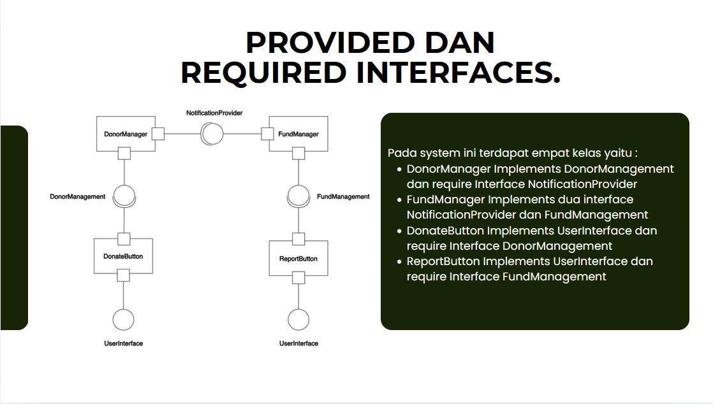

# Sistem Yayasan Sederhana

Sistem informasi yayasan sederhana yang dibangun menggunakan pendekatan Component-Based Software Engineering (CBSE) dengan penerapan konsep interface provided dan required.

## Deskripsi

Aplikasi ini merupakan implementasi sistem manajemen yayasan sederhana yang memungkinkan pengguna untuk:
- Mencatat donasi dari donatur
- Mengelola dana yayasan
- Mengalokasikan dana untuk program tertentu
- Melihat laporan keuangan
- Melihat informasi donatur

Aplikasi ini dirancang menggunakan prinsip Component-Based Software Engineering (CBSE) dengan pendekatan "Design by Contract" melalui provided dan required interfaces.

## Struktur Komponen



Sistem ini terdiri dari beberapa komponen utama:

1. **DonorManager**
   - Mengelola data donatur dan donasi
   - Menyediakan interface `DonorManagement`
   - Membutuhkan interface `NotificationProvider`

2. **FundManager**
   - Mengelola dana dan laporan keuangan
   - Menyediakan interface `FundManagement` dan `NotificationProvider`

3. **DonateButton**
   - Antarmuka untuk melakukan donasi
   - Menyediakan interface `UserInterface`
   - Membutuhkan interface `DonorManagement`

4. **ReportButton**
   - Antarmuka untuk melihat laporan
   - Menyediakan interface `UserInterface`
   - Membutuhkan interface `FundManagement`

## Interface

1. **DonorManagement**
   ```java
   public interface DonorManagement {
       public void recordDonation(String donorId, double amount);
       public String getDonorInfo(String donorId);
   }
   ```

2. **FundManagement**
   ```java
   public interface FundManagement {
       public void recordFunds(double amount, String source);
       public String generateReport();
   }
   ```

3. **NotificationProvider**
   ```java
   public interface NotificationProvider {
       public void sendNotification(String recipient, String message);
       public void sendReport(String recipient, String report);
   }
   ```

4. **UserInterface**
   ```java
   public interface UserInterface {
       public void buttonPressed();
   }
   ```

## Cara Menjalankan Aplikasi

### Prasyarat
- Java Development Kit (JDK) 8 atau lebih tinggi
- Java IDE (Eclipse, IntelliJ IDEA, NetBeans) atau text editor dan command line

### Langkah-langkah
1. Clone repository ini
   ```
   git clone https://github.com/ahmadsyah28/system-management-foundation.git
   cd system-management-foundation
   ```

2. Kompilasi semua file Java
   ```
   javac *.java
   ```

3. Jalankan aplikasi
   ```
   java YayasanSystem
   ```

4. Ikuti menu interaktif di konsol untuk menggunakan aplikasi

## Fitur

1. **Donasi Baru**
   - Masukkan ID donor
   - Masukkan jumlah donasi
   - Sistem akan mencatat donasi dan mengirim notifikasi

2. **Lihat Laporan Dana**
   - Menampilkan total dana yang terkumpul
   - Menampilkan dana yang telah dialokasikan
   - Menampilkan dana yang tersedia
   - Menampilkan riwayat transaksi

3. **Lihat Info Donor**
   - Masukkan ID donor untuk melihat informasinya
   - Menampilkan total donasi dan riwayat donasi

4. **Alokasikan Dana**
   - Masukkan jumlah yang ingin dialokasikan
   - Masukkan tujuan alokasi dana
   - Sistem akan mencatat alokasi dana

## Konsep Design by Contract

Aplikasi ini menerapkan konsep "Design by Contract" dengan:

1. **Provided Interfaces**: Kontrak yang disediakan oleh komponen untuk digunakan oleh komponen lain
2. **Required Interfaces**: Kontrak yang dibutuhkan oleh komponen dari komponen lain
3. **Preconditions**: Kondisi yang harus dipenuhi sebelum operasi dijalankan
4. **Postconditions**: Jaminan yang diberikan setelah operasi dijalankan

## Pengembangan Lebih Lanjut

Beberapa ide untuk pengembangan lebih lanjut:
- Menambahkan persistensi data menggunakan file atau database
- Menambahkan GUI menggunakan JavaFX atau Swing
- Menambahkan fitur autentikasi untuk admin dan donatur
- Implementasi logging untuk aktivitas sistem
- Menambahkan fitur pencarian dan filter untuk laporan

## Kontribusi

Kontribusi sangat diterima. Untuk berkontribusi:
1. Fork repository ini
2. Buat branch baru (`git checkout -b feature/fitur-baru`)
3. Commit perubahan Anda (`git commit -m 'Menambahkan fitur baru'`)
4. Push ke branch (`git push origin feature/fitur-baru`)
5. Buat Pull Request baru

## Angota Tim
